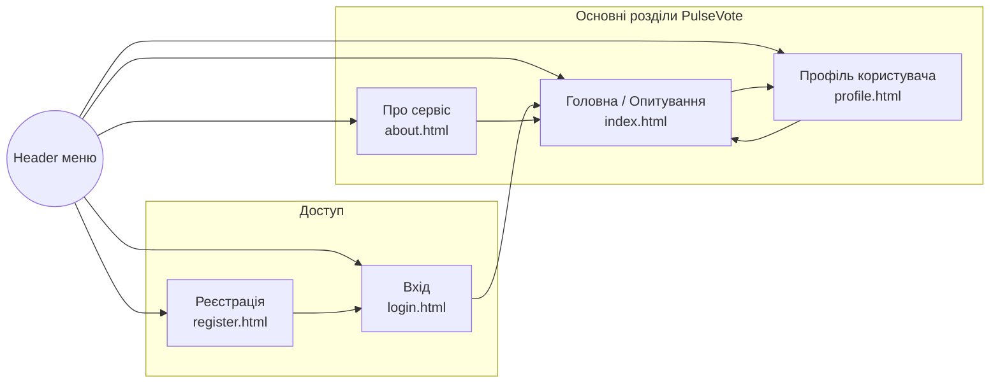

```mermaid
---
config:
  layout: dagre
  curve: linear
---
flowchart LR
  H((Header меню))

  subgraph Core["Основні розділи PulseVote"]
    W["Головна / Опитування<br>index.html"]
    A["Про сервіс<br>about.html"]
    P["Профіль користувача<br>profile.html"]
  end

  subgraph Auth["Доступ"]
    L["Вхід<br>login.html"]
    R["Реєстрація<br>register.html"]
  end

  H --> W
  H --> A
  H --> P
  H --> L
  H --> R

  L --> W
  R --> L
  W --> P
  P --> W
  A --> W
```
